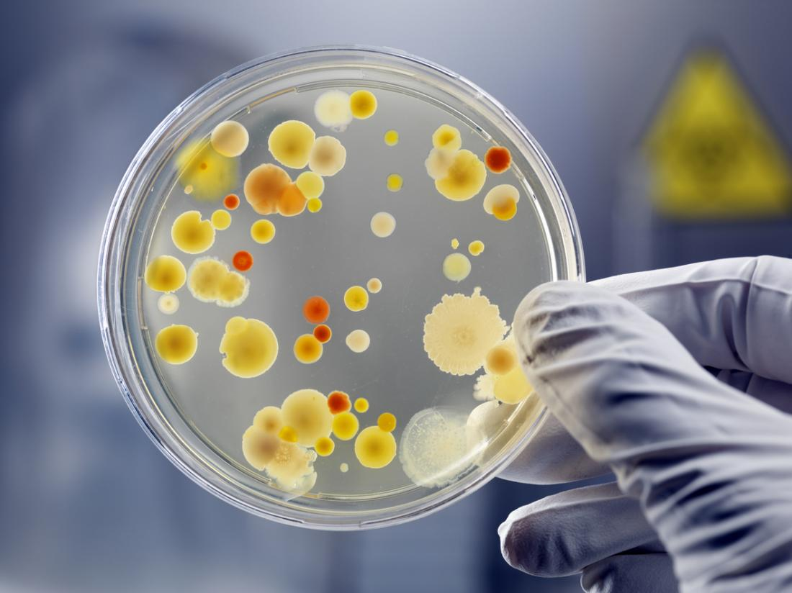
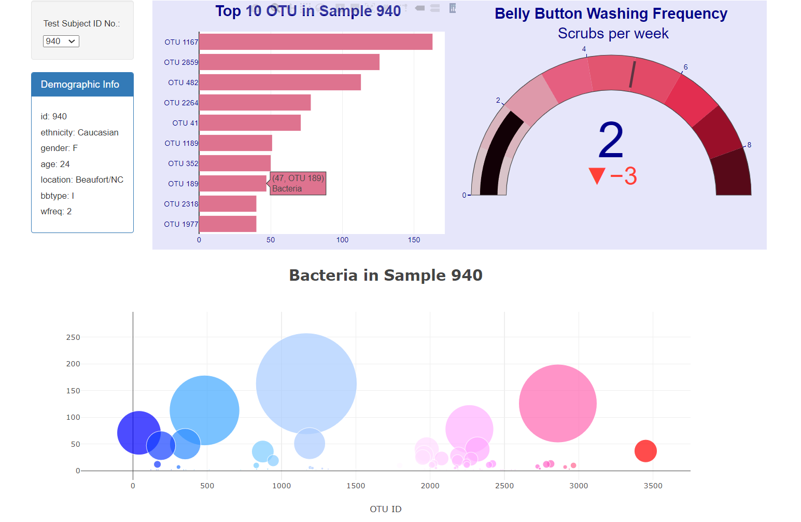
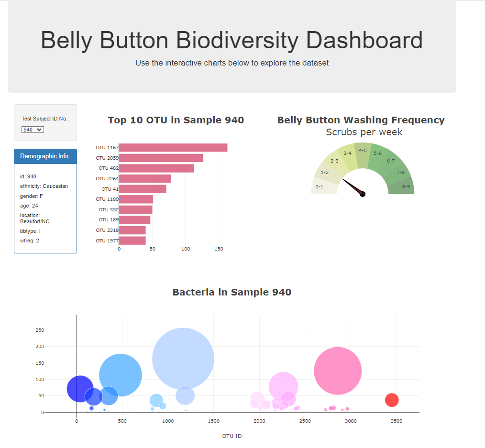

# belly-button-challenge

In this assignment, an interactive dashboard to explore the [Belly Button Biodiversity](http://robdunnlab.com/projects/), which catalogs the microbes that colonize human navels is created .

The dataset reveals that a small handful of microbial species (also called operational taxonomic units, or OTUs, in the study) were present in more than 70% of people, while the rest were relatively rare.
## Deployment 

The interactive dashboard for the app was can be loacted [here](https://rimpledabas.github.io/belly-button-challenge/)

## Scripts 

- [app.js](https://github.com/RimpleDabas/belly-button-challenge/blob/main/static/js/app.js) is the script used for the creation of dashboard

- [index.html](https://github.com/RimpleDabas/belly-button-challenge/blob/main/index.html) is the respective html file for the visualization.

## Dashboard 

The final dashoard looks like the image below. Hover over the charts for values.Use drop down menu for changing the subject id

 
 

The second dashboard with needle pointer gauge looks like the image below

